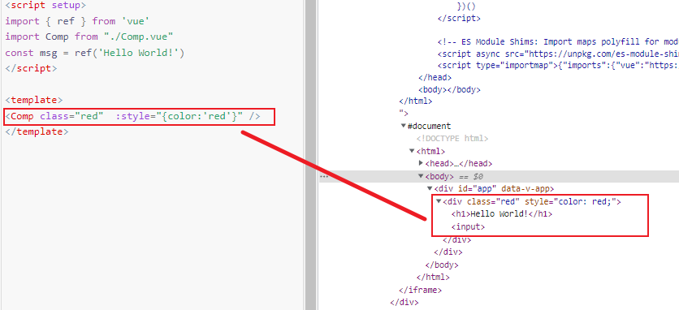

# 知其然不知其所以然，Vue3如何实现的？
## inheritAttrs 作用与其实现
文档上是这样描述 inheritAttrs   
>用于控制是否启用默认的组件 attribute 透传行为。[地址](https://cn.vuejs.org/api/options-misc.html#inheritattrs)

可以看出是应用与组件上，作用是控制属性是否透传,那么为什么需要这样来控制？首先需要知道在Vue中传值分为2种 Props 和 Attrs 传值方式都相同，区别在于是否在组件中声明。通常来说attrs可能会默认的传递一些css的属性，例如class、style，而 inheritAttrs 就可以来控制这些属性是否能传统到组件上。

### 源码实现
判断inheritAttrs是否为ture, 当为 true 时 closeElement(root)